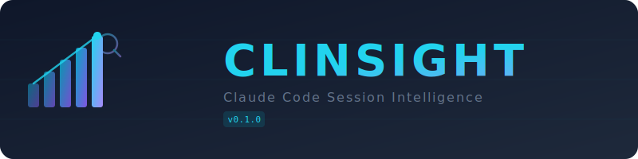

<p align="center">
  
  <br><br>
  <strong>Automatically record, analyze, and compound your Claude Code sessions</strong>
</p>
<p align="center">
  <p align="center">
    <a href="#quickstart">Quick Start</a> &middot;
    <a href="INSTALL.md">Install Guide</a> &middot;
    <a href="#features">Features</a> &middot;
    <a href="#how-it-works">How It Works</a> &middot;
    <a href="README.md">한국어</a>
  </p>
  <p align="center">
    
    
    
    
  </p>
</p>

---

## Why Clinsight?

If you use Claude Code, you've probably experienced this:

> *"What did I discuss with Claude yesterday..."*
> *"Session got lost, now I'm explaining everything from scratch"*
> *"That prompt was so good... which session was it again?"*
> *"Didn't realize I spent $30+ in a single session until it was too late"*

Sessions are ephemeral, but the insights from them don't have to be.

**Clinsight automatically records and analyzes your Claude Code usage, turning today's trial-and-error into tomorrow's assets.**

---

<h2 id="quickstart">Quick Start</h2>

### npm (recommended)

```bash
npm install -g clinsight

# Register hooks with Claude Code (starts automatic session recording)
clinsight-setup

# Launch the dashboard
clinsight
```

### From source

```bash
git clone https://github.com/wooo-jin/clinsight.git
cd clinsight
pnpm install && pnpm build

# Register hooks with Claude Code
pnpm setup

# Launch the dashboard
pnpm dev
```

See [INSTALL.md](INSTALL.md) for detailed installation instructions.

---

<h2 id="features">Features</h2>

### 1 &mdash; Automatic Session Archive

Hooks into Claude Code's hook system to **automatically record every conversation**.
Recording starts when a session begins and creates a complete archive when it ends.
No manual steps &mdash; just use Claude Code as usual.

### 2 &mdash; TUI Dashboard

A 7-tab terminal dashboard accessible right from your terminal:

```
+-----------------------------------------------------------+
|  Clinsight  | 42 sessions | updated 17:30                 |
|                                                           |
|  Dashboard  Insights  Sessions  Cost  Compound  Archive   |
|                                                           |
|  +-- Today --+  +-- Week ---+  +-- Month --+             |
|  | Sessions: 8|  | Sessions: 34|  | Sessions: 142|       |
|  | Cost: $4.20|  | Cost: $18.5 |  | Cost: $72.30 |       |
|  | Score: 82  |  | Score: 78   |  | Score: 75    |       |
|  +-----------+  +------------+  +-------------+          |
|                                                           |
|  7-day cost trend    ............                          |
|  7-day efficiency    ............                          |
|                                                           |
|  [1-7] tabs  [Tab] navigate  [r] refresh  [q] quit       |
+-----------------------------------------------------------+
```

| Tab | Description |
|---|---|
| **Dashboard** | Today/weekly/monthly summary, cost trends, efficiency scores |
| **Insights** | Churn detection, context saturation warnings, improvement suggestions |
| **Sessions** | Per-session analysis (tokens, tool usage, edited files) |
| **Cost** | Cost breakdown by model and project |
| **Compound** | AI-powered pattern extraction and knowledge compounding |
| **Archive** | Browse full session conversation history |
| **Settings** | Configure archive retention periods |

### 3 &mdash; Session Analysis Engine

Each session is automatically analyzed and assigned an **efficiency score** (0-100).

```
Efficiency = f(first-try rate, churn index, exploration efficiency, context saturation, duration)
```

| Metric | How It's Measured |
|---|---|
| **Churn Index** | Number of edit reversions (not just repeated edits) |
| **Exploration Efficiency** | Ratio of read-only files that didn't contribute to edits |
| **Context Saturation** | Actual usage vs. model context window size |
| **First-Try Rate** | Percentage of edits completed without reversions |
| **Cost Tracking** | Based on actual per-token pricing by model |

### 4 &mdash; Compound (Knowledge Compounding)

A nightly cron job sends the day's sessions to Claude for deep analysis.

```
Today's sessions  -->  Pattern recognition   -->  Actionable rules
                       Solution extraction        for CLAUDE.md
                       Convention mining
                       Golden prompt preservation
```

> **Today's struggles become tomorrow's assets.**

### 5 &mdash; Real-Time Alerts

Analyzes the current session on every prompt. When issues are detected, warnings are injected into Claude's context so Claude naturally addresses them in its responses.

| Condition | What Claude Says |
|---|---|
| Context 75%+ | "You may need /compact soon" |
| Context 90%+ | "Running /compact is recommended" |
| Cost $10+ | "Costs are getting high" |
| 3+ reversions | "Consider re-evaluating your approach" |
| 60min+ session | "40-50 minute sessions are more efficient" |

No separate notification popups. Claude mentions it naturally in conversation.

### 6 &mdash; Zombie Session Detection

Detects orphaned processes and abandoned session directories, with one-click cleanup.

---

<h2 id="how-it-works">How It Works</h2>

```
Claude Code Session
       |
       +-- SessionStart --> Hook --> Initialize archive
       |
       +-- PromptSubmit --> Hook --> Sync conversation + real-time analysis
       |                              |
       |                              +--> If warning threshold met:
       |                                    Inject into Claude's context
       |
       +-- SessionStop  --> Hook --> Create complete archive
                                         |
                                    +----+-----+
                                    |          |
                              TUI Dashboard  Cron (23:00)
                              Live browsing  Compound analysis
                                             Pattern/solution extraction
```

---

## Tech Stack

| | |
|---|---|
| **Runtime** | Node.js 18+ |
| **UI** | Ink + React (Terminal UI) |
| **Language** | TypeScript strict mode |
| **Architecture** | Feature-Sliced Design (FSD) |
| **Integration** | Claude Code Hooks |
| **Test** | Vitest (109 tests) |
| **Platform** | macOS, Linux, Windows |

---

## License

[MIT](LICENSE)
